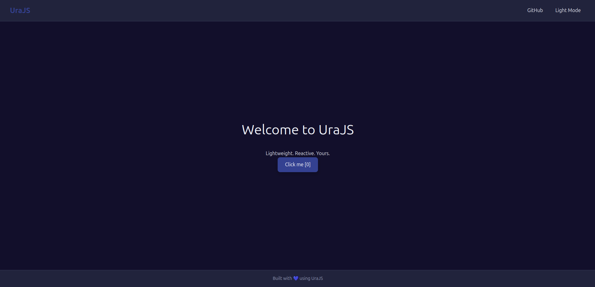
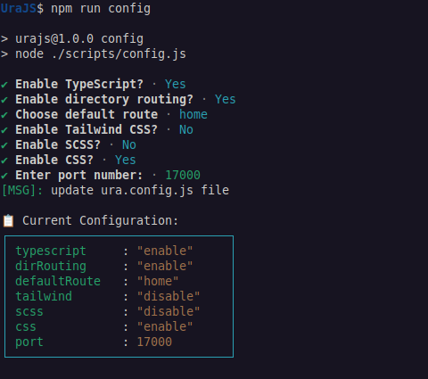

<p align="center">
  
</p>


**UraJS** is a lightweight single-page application (SPA) framework designed to make building interactive and dynamic web applications intuitive and efficient.

Inspired by the simplicity of **React**, the directory-based routing of **Next.js**, UraJS introduces its own take on SPA development. Its directory-based routing system automatically generates routes from the file structure, streamlining navigation setup for developers.

With built-in support for **live reloading**, **state-driven UI updates**.

## Summary
- [Get Started](#get-started)
- [Usage](#usage)
- [First component](#generating-routes)
- [Configuration](#configuration)
- [Using Custom Routing (not recommended)](#using-custom-routing)
- [Example Generated Component Code](#example-generated-component-code)
- [Custom Navbar with "navigate" hook](#example-creating-a-custom-navbar-component-for-the-homepage)
- [Tailwind support](#tailwind)
- [Custom tags (if/else/loop)](#custom-tags)
- [Deploy using Docker](#deploy-using-docker)

## Get Started

To get started with **UraJS**, follow these simple steps:
1. **Clone the repository**:
```bash
   git clone https://github.com/mohammedhrima/UraJS
```
2. **Navigate to the project directory**:
```bash
   cd UraJS
```
3. **Install the dependencies**:
```bash
   npm install
```
4. **Start the development server**:
```bash
   npm start
```
5. **Open your browser** and visit http://localhost:17000 to see the app running.
+ you should see something like this
<p align="center">
  
</p>

6. **all commands**:
```bash
  npm start #start server
```
```bash
  npm run clear #clear outfile
```
```bash
  npm run route #create route
```
```bash
  npm run comp #create component
```
```bash
  npm run build #to build
```
```bash
  npm run config #change configuration
```

## Usage
To generate routes automatically, you can use the following commands:
- To generate a **basic route and its CSS/SCSS file if neede**, run:
    
    ```bash
      npm run route /helloworld
    ```

+ This will create 
`pages/helloworld/helloworld.[jsx|tsx]` mapped to the /helloworld route.
`pages/helloworld/helloworld.[css|scss]` for styling the route.
After generating the route and its styles, visit the route in the browser by navigating to the corresponding URL `http://localhost:17000/helloworld`

- To generate a **nested route and its SCSS file**, run:
    
    ```bash
      npm run route /helloworld/again
    ```

## folders structure:
```
    UraJS/
    ├── out/ # Production-ready transpiled JavaScript files
    │   └── (All framework and app code transpiled to vanilla JS)
    │
    ├── scripts/ # scripts used by the framework.
    │
    ├── src/
    │   ├── assets/ # Static assets
    │   │   └── (image.png, ...)
    │   │
    │   ├── components/ # Reusable UI components
    │   │   ├── Button/ # Example component
    │   │   │   ├── Button.jsx
    │   │   │   └── Button.css
    │   │   └── (Other components...)
    │   │
    │   ├── pages/ # Route-based components
    │   │   ├── home/ # Example route: /home
    │   │   │   ├── home.jsx # Route component
    │   │   │   └── home.css # Route-specific styles
    │   │   │
    │   │   ├── main.js # Application entry point
    │   │   ├── main.scss # Global styles/variables
    │   │   └── tailwind.css # Tailwind imports (if enabled)
    │   │
    │   ├── services/ # Business logic/services
    │   │   ├── api.jsx # API service layer
    │   │   └── events.js # Event bus/service (in developement)
    │   │
    │   └── ura/ # Framework frontend code
    │
    ├── tailwind.config.js # Tailwind CSS configuration
    ├── ura.config.js # Framework configuration
    ├── tsconfig.json # TypeScript configuration
    └── package.json # Project dependencies and scripts
             
```

## Configuration
+ The `ura.config.js` file allows you to customize various settings for your project
+ Default config:
```js
    typescript: "disable" 
    dirRouting: "enable"
    defaultRoute: "home"
    tailwind: "disable"
    scss: "disable"
    css: "enable"
    port: 17000
```
+ to change it: run
```bash
  npm run config #change configuration
```
+ you will get a validation messages like this
<p align="center">
  
</p>

## Example Generated JSX
+ Component:
```js
    import Ura from 'ura';
    
    function Component() {
      const [render, State] = Ura.init();  // Initialize Ura and state management
      const [getter, setter] = State(0);  // Declare a state with an initial value of 0
    
      return render(() => (
        <div className="component">
          <h1>Hello from the Component component!</h1>
          <button onclick={() => setter(getter() + 1)}>
            Click me [{getter()}]
          </button>
        </div>
      ));
    }
    
    export default Component;
```
+ Route:
```js
    function Route() {
      document.title = "Route Page";
      const [render, State] = Ura.init();
      const [count, setCount] = State(0);
      const [darkMode, setDarkMode] = State(true);

      return render(() => (
        <root>
          <div className={`home ${darkMode() ? 'dark' : 'light'}`}>
            <header className="navbar">
              <div className="logo">UraJS</div>
              <nav>
                <a href="https://github.com/mohammedhrima/UraJS/" target="_blank">GitHub</a>
                <a onclick={() => setDarkMode(!darkMode())}>
                  {darkMode() ? 'Light Mode' : 'Dark Mode'}
                </a>
              </nav>
            </header>

            <main className="body">
              <h1>Welcome to UraJS</h1>
              <p className="subtitle">Lightweight. Reactive. Yours.</p>
              <button onclick={() => setCount(count() + 1)}>
                Click me [{count()}]
              </button>
            </main>

            <footer className="footer">
              <p>Built with 💙 using UraJS</p>
            </footer>
          </div>
        </root>
      ));
    }
   export default Route;
```
#### Explanation of the Code:
1. State: 
- used to updated the view wherever the value change: `const [getter, setter] = State(initialValue); `
- componenet can hold multiple states
- essential for updating the view weh state change
2. Rendering the Component:
+ `return render(() => ( ... ))`: saves JSX component for future reconciliation.
3. Event Handling:
+ `<button onclick={() => setter(getter() + 1)}>`: onlick state change
+ In UraJS, event names should be written in lowercase. This is the standard convention for handling events in JavaScript.
    + For example:
        + `onclick` for mouse clicks.
        + `onchange` for input changes.
        + `onkeyup` for key presses.
For a complete list of event names, check W3Schools JavaScript Events  (https://www.w3schools.com/jsref/obj_events.asp)
4. `<root></root>` reference to the `<div id="root"></div>` in ./src/index.html
## Example Creating a Custom Navbar Component for the Homepage
```bash
    npm run comp /Navbar
```
```js
    // components/Navbar/Navbar.jsx
    import Ura from 'ura';
    
    function Navbar() {
      const [render, State] = Ura.init();
    
      return render(() => (
        <nav className="navbar">
          <ul>
            <li onclick={() => Ura.navigate("/home")}><a href="/home">Home</a></li>
            <li onclick={() => Ura.navigate("/about")}><a href="/about">About</a></li>
          </ul>
        </nav>
      ));
    }
    
    export default Navbar;
```
**Explanation of the navigate Hook:**

+ `Ura.navigate` is a built-in function in UraJS that programmatically changes the current route of the app. When you call this function, it will update the URL and load the corresponding component.

### Adding the Navbar to the Home Page

Once the `Navbar` component is created, you can include it in your `home` page component. For instance:

```js
    // pages/home/home.jsx
    import Ura from 'ura';
    import Navbar from '../../components/Navbar/Navbar.js';
    
    function Home() {
      const [render, State] = Ura.init();
    
      return render(() => (
        <div>
          <Navbar />
          <h1>Welcome to the Home Page!</h1>
        </div>
      ));
    }
    
    export default Home;
```

### Component That Navigates with Parameters
This component uses Ura.navigate to navigate to a new page (`/userDetails`) and passes the `name` and `email` parameters.
```js
    import Ura from 'ura';
    
    function UserPage() {
      const [render, State] = Ura.init();
    
      return render(() => (
        <div className="user-page">
          <h1>Welcome to the User Page!</h1>
          <button onclick={() => Ura.navigate("/userDetails", { name: "John Doe", email: "john.doe@example.com" })}>
            Show Details
          </button>
        </div>
      ));
    }
    
    export default UserPage;
```
#### Component That Receives and Visualizes the Parameters (e.g., UserDetails)
This component receives the name and email parameters from the navigation and displays them.
```js
    import Ura from 'ura';
    
    function UserDetails() {
      const [render, State] = Ura.init();
      const {name, email} = Ura.getParams();
      return render(() => (
        <div className="userDetails">
          <h1>User Name: {name}</h1>
          <p>Email: {email}</p>
        </div>
      ));
    }
    
    export default UserDetails;

```

## Tailwind
+ make sure to enbale the tailwind in config to see the change
```js
  import Ura from "ura"

  function Button() {
    const [render, State] = Ura.init();

    return render(() => (
      <button className="px-4 py-2 bg-blue-500 text-white rounded-lg hover:bg-blue-700 transition-colors duration-300">
        Click Me
      </button>
    ));
  }
```

## Conditions:
- `<if>` and `<else>` tag can be treated as any tag you can style theme, add className etc...
- or you can use `ura-if` and `ura-else`
- `if` takes condition as an attribute `cond`
- but `ura-if` takes condition as callback
```js
    import Ura from "ura";

    function UserProfile() {
      const [render, State] = Ura.init();
      const [getUser, setUser] = State({
        name: "Alex Johnson",
        role: "premium", // Try changing to "free" or "admin"
        lastLogin: new Date(),
        posts: 42
      });

      return render(() => (
        <div className="profile-container">
          <h1>Welcome back, {getUser().name}!</h1>
          
          {/* Approach 1: Custom <if>/<else> tags */}
          <if cond={getUser().role === "admin"} className="bg-red-100"> {/*you can style theme*/}
            <div class="admin-banner">
              ⚙️ ADMIN DASHBOARD ACCESS
            </div>
          </if>
          <else cond={getUser().role === "premium"}>
            <p class="premium-badge">🌟 Premium Member</p>
          </else>
          <else>
            <p>Free account - <a href="/upgrade">Upgrade to Premium</a></p>
          </else>

          {/* Approach 2: ura-if/else attributes */}
          <div ura-if={() => getUser().posts > 0}>
            <h2>Your Activity</h2>
            <p>You've created {getUser().posts} posts</p>
            <div ura-if={() => getUser().posts > 30}>
              <p>🔥 You're a top contributor!</p>
            </div>
            <div else>
              <p>Keep posting to unlock badges!</p>
            </div>
          </div>
          <div else>
            <h2>Get Started</h2>
            <p>You haven't posted yet. <button>Create your first post</button></p>
          </div>

          {/* Approach 3: Ternary operator */}
          <div class="login-status">
            {new Date().getTime() - getUser().lastLogin.getTime() < 86400000
              ? <span class="recent-login">✔️ Active today</span>
              : <span class="inactive-warning">⚠️ Last seen {Math.floor(
                  (new Date().getTime() - getUser().lastLogin.getTime()) / 86400000
                )} days ago</span>
            }
          </div>
        </div>
      ));
    }

    export default UserProfile;
```
## Loops:
- `<loop>` tag can be treated as any tag you can style it, add className etc...
```js
    function ProductList() {
      const [render, State] = Ura.init();
      const [products, setProducts] = State([
        { id: 1, name: "Wireless Headphones", price: 99.99, inStock: true },
        { id: 2, name: "Smart Watch", price: 199.99, inStock: false },
        { id: 3, name: "Bluetooth Speaker", price: 59.99, inStock: true }
      ]);

      return render(() => (
        <div class="product-grid">
          <h2>Featured Products</h2>
          
          <loop on={products()}>
            {(product) => (
              <div class="product-card" key={product.id}>
                <h3>{product.name}</h3>
                <p>${product.price.toFixed(2)}</p>
                
                <if cond={product.inStock}>
                  <button>Add to Cart</button>
                  <p class="stock in-stock">In Stock</p>
                </if>
                <else>
                  <button disabled>Out of Stock</button>
                  <p class="stock out-of-stock">Backorder Available</p>
                </else>
                
                <div class="product-actions">
                  <button>Compare</button>
                  <button>Save for Later</button>
                </div>
              </div>
            )}
          </loop>
        </div>
      ));
    }
```
```js
    function NotificationBell() {
      const [render, State] = Ura.init();
      const [notifications, setNotifications] = State([
        "New message from Sarah",
        "Your order has shipped",
        "3 new followers"
      ]);

      return render(() => (
        <div class="notification-dropdown">
          <button class="bell-icon">🔔</button>
          
          <div class="dropdown-content" ura-loop={notifications()}>
            {(msg, index) => (
              <div class="notification-item" key={index}>
                <p>{msg}</p>
                <button class="dismiss-btn">×</button>
              </div>
            )}
          </div>
        </div>
      ));
    }
```
```js
    function BlogPost() {
      const [render, State] = Ura.init();
      const [tags, setTags] = State(["javascript", "webdev", "urajs", "tutorial"]);

      return render(() => (
        <article>
          <h1>Getting Started with UraJS</h1>
          <p>Lorem ipsum dolor sit amet...</p>
          
          <div class="tag-container">
            {tags().map(tag => (
              <span class="tag-pill" key={tag}>
                #{tag}
              </span>
            ))}
          </div>
          
          <div class="related-posts">
            {/* Combined with ternary for conditional rendering */}
            {tags().length > 0
              ? tags().slice(0,3).map(tag => (
                  <a href={`/tags/${tag}`} class="tag-link">
                    More about {tag}
                  </a>
                ))
              : <p>No tags for this post</p>
            }
          </div>
        </article>
      ));
    }
```
## Deploy using docker

1. Build the Project
+ To build the project and generate the necessary Docker configuration files, run the following command:
```bash
    npm run build
```
This command will use Nginx to serve your static files and generate a docker directory with the following structure:
```
    docker/
    ├── app/                # Contains all transpiled files (e.g., JavaScript, CSS, etc.)
    ├── nginx/              # Contains the nginx configuration file
    │   └── nginx.conf
    ├── Dockerfile          # Dockerfile to build the application container
    ├── docker-compose.yml  # Docker Compose file to set up and run the container
    └── Makefile            # Makefile to run Docker container
```

2. Build and Run the Container

+ After running npm run build, navigate to the docker directory:
```bash
    cd docker
```
+ To start the Docker container, run:
```bash
    make
```
3. Stop the Container
```bash
    make down
```

4. Clean Up Volumes and Remove Docker Images
```
    make clean
```

5. Check Nginx Configuration
+ The Nginx configuration is in docker/nginx/nginx.conf. It serves the transpiled files
+ Check the port in nginx.conf (e.g., listen 17000). The port is automatically selected during the build process by choosing the available one.
+ After starting the container, open your browser and go to:
```
    http://localhost:17000
```
