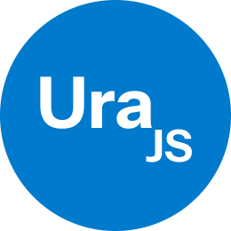

<p align="center">
  
</p>


**UraJS** is a lightweight, modern single-page application (SPA) framework designed to make building interactive and dynamic web applications intuitive and efficient. It combines the power of **JSX**, **virtual DOM reconciliation**, and a **custom state management system** to provide a seamless development experience without the bloat.

Inspired by the simplicity of **React**, the directory-based routing of **Next.js**, and the flexibility of **Vue**, UraJS introduces its own take on SPA development. Its directory-based routing system automatically generates routes from the file structure, streamlining navigation setup for developers.

With built-in support for **live reloading**, **state-driven UI updates**, and a focus on performance, UraJS empowers developers to create fast, maintainable, and user-friendly applications.

## Summary
- [Get Started](#get-started)
- [Usage](#usage)
- [First component](#generating-routes)
- [Configuration](#configuration)
- [Using Custom Routing (not recommended)](#using-custom-routing)
- [Example Generated Component Code](#example-generated-component-code)
- [Custom Navbar with "navigate" hook](#example-creating-a-custom-navbar-component-for-the-homepage)
- [Tailwind support](#tailwind)
- [HTTP Requests](#http-requests)
- [Custom Tags (if/else/loop)](#custom-tags)
- [Build and Run using Docker](#build-and-run-using-docker)

## Get Started

To get started with **UraJS**, follow these simple steps:
1. **Clone the repository**:
```bash
   git clone https://github.com/mohammedhrima/UraJS
```
2. **Navigate to the project directory**:
```bash
   cd UraJS
```
3. **Install the dependencies**:
```bash
   npm install
```
4. **Start the development server**:
```bash
   npm start
```
5. **Open your browser** and visit http://localhost:17000 to see the app running.
6. **folders structure**:

```
    UraJS/
    ├── out/                        # Contains the transpiled pure vanilla JavaScript files.
    │   └── (Transpiled files)      # Automatically generated files after compilation from TypeScript/JSX to vanilla JS.
    ├── scripts/                    # Contains all the scripts used in development (e.g., build, test, custom utilities).
    ├── src/                        # Main source code for your app and framework.
    │   ├── assets/                 # Recommended folder to store static files like images, fonts, etc.
    │   │   └── (Image files)       # Place image assets here for easy management.
    │   ├── pages/                  # Contains all route components and related files.
    │   │   ├── home/               # Folder for the home route (e.g., /home).
    │   │   │   ├── home.jsx        # Home route component.
    │   │   │   └── home.(scss|css) # Styling for the home route.
    │   │   ├── (Other pages)       # Other route components, following the same structure.
    │   │   ├── global.(scss|css)   # Global styling variables and shared styles.
    │   │   ├── main.js             # Main entry point for the framework (initializes the app).
    │   │   ├── main.(scss|css)     # Default styling for the entire application.
    │   │   └── routes.json         # Contains all routes 
    │   └── ura/                    # Framework source code (core logic of UraJS).
    ├── config.json                 # Configuration file for framework settings (e.g., default route, port, styling options).
    ├── tsconfig.json               # TypeScript configuration file for compiling the code (customizable).
    ├── index.html                  # The main HTML file where the app is loaded.
    └── package.json                # Project metadata, dependencies, and scripts (e.g., npm start).
```

## Usage

Once the development server is running, you can begin creating your app. **UraJS** uses a file-based routing system, meaning that the structure of your project’s files will directly map to your routes. Simply add a new file in the `pages` directory to create a new route.

For example:
- `pages/about/about.jsx` maps to the `/about` route.
- `pages/home/home.jsx` maps to the `/home` route.

## Generating Routes
To generate routes automatically, you can use the following commands:
- To generate a **basic route and its SCSS file**, run:
    
    ```bash
      npm run gen /routename
    ```

+ This will create 
`pages/routename/routename.jsx` mapped to the /routename route.
`pages/routename/routename.scss` for styling the route.
After generating the route and its styles, visit the route in the browser by navigating to the corresponding URL `http://localhost:17000/routename`

- To generate a **nested route and its SCSS file**, run:
    
    ```bash
      npm run gen /routename/nestedroute
    ```

+ This will create 
`pages/routename/nestedroute/nestedroute.jsx` mapped to the /routename/nestedroute route.
`pages/routename/nestedroute/nestedroute.scss` for styling the nested route.
After generating the route and its styles, visit the route in the browser by navigating to the corresponding URL `http://localhost:17000/routename/nestedroute`.


Make sure the file structure matches the route you want to create, as UraJS automatically generates routes based on the folder hierarchy within the `pages` directory. Each route will have a matching SCSS file that is automatically linked to the JSX component.

The `src/global.scss` file is used for global variables for a fast user experience.

By default, UraJS will compile SCSS into CSS for the styling of your routes. However, if you prefer to use plain CSS, you can configure it in the `config.json` file.


## Configuration
The `config.json` file allows you to customize various settings for your project, including file extensions, server configurations, and routing preferences. Here is an example configuration:

```json
    {
      "DEFAULT_ROUTE": "/home",
      "EXTENSION": "jsx",
      "STYLE_EXTENSION": "scss",
      "PORT": 17000,
      "SERVER_TIMING": 15,
      "DIR_ROUTING": true,
      "TYPE": "dev"
    }
```

+ Configuration Options:
    + `DEFAULT_ROUTE`: Specifies the default route for your app (e.g., /home).
    + `EXTENSION`: Defines the file extension for your components. You can set it to js, jsx, ts, or tsx.
    + `STYLE_EXTENSION`: Defines the file extension for stylesheets. You can set it to scss (default) or css or tailwind.
    + `PORT`: Defines the port for the development server (default: 17000).
    + `SERVER_TIMING`: Defines the timing to compile and serve files. Adjust this if you want to customize how often files are recompiled.
    + `DIR_ROUTING`: If set to true, UraJS will use the default directory-based routing system. Set it to false if you prefer to use your own routing system.
    + `TYPE`: Don't touch it


## Using Custom Routing 
+ it's optional (not recommended)
+ To use custom routing with UraJS, users can create and manage their routes manually by using the `routes.json` file. Here's how they can do it:

+ By default, UraJS uses a file-based routing system, but if you prefer to handle routes manually, you can disable the default directory routing by setting "DIR_ROUTING": false in the config.json file. This will allow you to manage your routes independently using the `routes.json` file.

+ After disabling directory routing, you can define routes and styles in `routes.json` as follows:

`/src/routes.json`:
```json
    {
      "routes": {
        "/home": "/pages/home/home.js",
        "/home/user": "/pages/home/user/user.js"
      },
      "styles": [
        "/pages/global.css",
        "/pages/home/home.css",
        "/pages/home/user/user.css",
        "/pages/main.css"
      ],
      "base": "/home",
      "type": "dev"
    }
```
+ How to Use routes.json:
1. **Disabling Directory Routing:**
    - In config.json, set `"DIR_ROUTING": false` to disable automatic file-based routing.
    - This will prevent UraJS from automatically creating routes based on the file and directory structure in the pages directory.
2. **Define Routes in route.json:**
    - The routes object in route.json maps URLs to specific files. For example:
        - `"/home"` maps to `"/pages/home/home.js"`.
        - `"/home/user"` maps to `"/pages/home/user/user.js"`.
    - You can define any custom URL paths and their corresponding file locations in the routes object.
3. **Define Styles in route.json:**
    - The styles array allows you to specify global and route-specific CSS or SCSS files. For example:
    -  `"/pages/global.css"` contains global variables.
    -  `"/pages/home/home.css"` and `"/pages/home/user/user.css"` are route-specific styles linked to their respective routes.
4. **Set the Default Route:**
    - The `"base"` property specifies the default route that the app will load when it starts. For example, setting `"base": "/home"` means the /home route will be the default `/`.

## Example Generated Component Code
+ When you run npm run gen Component, the generated JSX code looks like this:
```js
    import Ura from 'ura';
    
    function Component() {
      const [render, State] = Ura.init();  // Initialize Ura and state management
      const [getter, setter] = State(0);  // Declare a state with an initial value of 0
    
      return render(() => (
        <div className="component">
          <h1>Hello from the Component component!</h1>
          <button onclick={() => setter(getter() + 1)}>
            Click me [{getter()}]
          </button>
        </div>
      ));
    }
    
    export default Component;
```
#### Explanation of the Code:
1. Importing Ura:
+ `import Ura from 'ura'`: This imports the core framework functionality of UraJS, which is responsible for state management and rendering. It enables the use of Ura.init() and other features.

2. State Declaration:
+ `const [getter, setter] = State(0)`: This line declares a piece of state using `Ura.init()`.
    + `State(0)` initializes the state with a value of `0
    + `getter` is the function that retrieves the current state value
    + `setter` is the function used to update the state
    + **Important**: To declare a state in your component, use the following pattern:
```js 
    const [getter, setter] = State(initialValue);
```

where:
- getter() gives you the current state value.
- setter(newValue) updates the state with a new value.

3. Rendering the Component:
+ `return render(() => ( ... ))`: The render function is used to render the JSX in the browser. It takes a function that returns the component’s UI (HTML structure).
4. Event Handling:
+ `<button onclick={() => setter(getter() + 1)}>`: Here, we use an event handler to update the state when the button is clicked. In this case, the button click event calls the `setter` function to increment the value of `getter()`.
+ **Important**:
    + In UraJS, event names should be written in lowercase. This is the standard convention for handling events in JavaScript.
    + For example:
        + `onclick` for mouse clicks.
        + `onchange` for input changes.
        + `onkeyup` for key presses.
For a complete list of event names, check W3Schools JavaScript Events  (https://www.w3schools.com/jsref/obj_events.asp)

## Example Creating a Custom Navbar Component for the Homepage
+ In case you want to create a custom component, like a `Navbar`, and include it in your page, you can do so by following these steps:

1. **Generate a Custom Navbar Component**
    + To create a custom component for the Navbar within the home page, run:
```bash
    npm run gen home/utils/Navbar
```
2. **Navbar JSX Code:**
This will create a file at `pages/home/utils/Navbar.jsx`. The `Navbar` component will use UraJS's `navigate` function to handle route navigation. Here’s an example:
`pages/home/Navbar/Navbar.jsx`
```js
    import Ura from 'ura';
    
    function Navbar() {
      const [render, State] = Ura.init();
    
      return render(() => (
        <nav className="navbar">
          <ul>
            <li onclick={() => Ura.navigate("/home")}><a href="/home">Home</a></li>
            <li onclick={() => Ura.navigate("/about")}><a href="/about">About</a></li>
          </ul>
        </nav>
      ));
    }
    
    export default Navbar;
```
3. **Explanation of the navigate Hook:**

In the example above, we use the `Ura.navigate` function to handle navigation between routes. Here’s a breakdown of how it works:

1. What is `Ura.navigate`?

    `Ura.navigate` is a built-in function in UraJS that programmatically changes the current route of the app. When you call this function, it will update the URL and load the corresponding component.

2. Usage in `Navbar` Component

    Inside the `Navbar` component, each `<li>` element has an `onclick` event handler that calls `Ura.navigate`. This allows for routing without a full page reload, ensuring a smooth single-page application (SPA) experience.

    ```js 
    onclick={() => Ura.navigate("/home")}
    ```

    
    When a user clicks on the "Home" or "About" link, the Ura.navigate function will update the URL to the corresponding route (/home or /about), and UraJS will load the appropriate component for that route.

3. **Important Notes:**

    + This is especially useful for custom navigation components like sidebars or navbars, where you can control the flow of the app programmatically.


### Adding the Navbar to the Home Page

Once the `Navbar` component is created, you can include it in your `home` page component. For instance:

1. Home Page Code
In the `pages/home/home.jsx` file, import and render the Navbar component as follows:
```js
    import Ura from 'ura';
    import Navbar from './utils/Navbar/Navbar.jsx';
    
    function Home() {
      const [render, State] = Ura.init();
    
      return render(() => (
        <div>
          <Navbar />
          <h1>Welcome to the Home Page!</h1>
        </div>
      ));
    }
    
    export default Home;
```
2. Result:

    When you navigate to the /home route, the Navbar will be displayed at the top, allowing users to easily navigate to different sections of your application, such as the Home and About pages.

### Directory Structure Clarification

As a reminder, UraJS uses a directory-based routing system. For a directory to be considered a valid route, it must contain a component file (.js, .jsx, .ts, .tsx) with the same name as the directory. For example, the home directory must contain a home.jsx (or equivalent) file. Subdirectories will also be considered valid subroutes if they follow the same structure.

### Example Structure for Navbar in Home Page:
```
    pages
      └── home
          ├── home.jsx  // Main Home Page Component
          ├── home.scss // Main Home Scss
          └── utils
              └── Navbar
                  ├── Navbar.jsx  // Navbar Component
                  └── Navbar.scss // Navbar Scss
```

+ With this setup, you now have a Navbar component that users can click to navigate between routes, and you’re utilizing UraJS’s routing capabilities with the Ura.navigate function.

### Component That Navigates with Parameters
This component uses Ura.navigate to navigate to a new page (`/userDetails`) and passes the `name` and `email` parameters.
```js
    import Ura from 'ura';
    
    function UserPage() {
      const [render, State] = Ura.init();
    
      return render(() => (
        <div className="user-page">
          <h1>Welcome to the User Page!</h1>
          <button onclick={() => Ura.navigate("/userDetails", { name: "John Doe", email: "john.doe@example.com" })}>
            Show Details
          </button>
        </div>
      ));
    }
    
    export default UserPage;
```
#### Component That Receives and Visualizes the Parameters (e.g., UserDetails)
This component receives the name and email parameters from the navigation and displays them.
```js
    import Ura from 'ura';
    
    function UserDetails(props) {
      const [render, State] = Ura.init();
    
      return render(() => (
        <div className="userDetails">
          <h1>User Name: {props.name}</h1>
          <p>Email: {props.email}</p>
        </div>
      ));
    }
    
    export default UserDetails;

```
#### Explanation:

1. `UserPage` Component:
    + Displays a button that, when clicked, navigates to the `/userDetails` page.
    + Passes the `name` (`"John Doe"`) and `email` (`"john.doe@example.com"`) as parameters via `Ura.navigate`.
2. `UserDetails` Component:
    + Receives `name` and `email` parameters through `props`.
    + Displays the user’s name and email on the page.

+ When the button in UserPage is clicked, the page navigates to UserDetails and shows the user's name and email.

## Tailwind
To enable Tailwind CSS in your project, you need to set the `STYLE_EXTENTION` to `tailwind` in `config.json` file.
```json
  {
    "DEFAULT_ROUTE": "/home",
    "EXTENSION": "jsx",
    "STYLE_EXTENTION": "tailwind",
    "PORT": 17000,
    "SERVER_TIMING": 15,
    "DIR_ROUTING": true,
    "TYPE": "dev"
  }
```
+ Example Component with Tailwind Styling
```js
  import Ura from "ura"

  function Button() {
    const [render, State] = Ura.init();

    return render(() => (
      <button className="px-4 py-2 bg-blue-500 text-white rounded-lg hover:bg-blue-700 transition-colors duration-300">
        Click Me
      </button>
    ));
  }
```

## HTTP Requests
```js
   import Ura from "ura";
       
   function Form() {
     const [render, State] = Ura.init();
     const [getUsers, setUsers] = State(0);
     const POST = async (e) => {
       e.preventDefault();
       const name = document.getElementById("user_name").value;
       const email = document.getElementById("user_email").value;
       Ura.send(
         "POST", 
         "http://localhost:3000/create_user",
         {/*additional header */ },
         { name, email }
       )
       .then((res) => { if (res.status != 201) console.error("Error creating user"); })
       .catch((error) => { console.error("Error:", error); });
     };
   
     const GET = async (e) => {
       e.preventDefault();
       Ura.send(
         "GET", 
         "http://localhost:3000/users"
       )
       .then((res) => { if (res.status === 200) setUsers(res.data); else console.error("Error updating users"); })
       .catch((error) => { console.error("Error:", error); });
     };
   
     return render(() => (
       <div className="form">
         <h1>Form</h1>
         <form action="userForm" onsubmit={POST}>
           <input type="text" id="user_name" />
           <input type="text" id="user_email" />
           <button type="submit">Create User</button>
         </form>
   
         <h1>Get All Users</h1>
         <button onclick={GET}>Get users</button>
         <loop on={getUsers()}>{(elem) => <h1>{elem.name}</h1>}</loop>
       </div>
     ));
   }
   
   export default Form;
```
UraJS provides a simple and efficient way to send HTTP requests using the Ura.send() method. This allows you to make any valid requests to your server or any other API endpoint.
Here’s how it works:
### POST Request (Sending Data)
The POST function is triggered when the user submits the form. It prevents the default form submission behavior (e.preventDefault()), extracts the data from the form fields, and sends it to the server:

**Explanation**:
+ Ura.send(): Sends an HTTP request.
    + Method: POST (to create new data).
    + URL: The endpoint to which the data is sent.
    + Headers: Optional headers (such as authentication).
    + Body: Data you want to send in the request (e.g., name and email).
    + `.then()`: Handles a successful response. If the server responds with a status code other than 201 (created), it logs an error.
    + `.catch()`: Catches any errors (e.g., network issues) and logs them.

### GET Request (Fetching Data)
The GET function is used to retrieve all users from the server:
**Explanation**:
+ Ura.send("GET", ...): Sends a GET request to fetch data.
    + URL: The endpoint to fetch the data from.
    + `.then()`: Handles the response. If the response status is 200 (success), it updates the state with the fetched data (setUsers(res.data)).
    + `.catch()`: Catches errors and logs them.

## Custom Tags
### `<loop>`:

+ `<loop>` tag in UraJS allows you to iterate over an array and render content dynamically for each item. It takes in a property on, which is the array you want to iterate over, and a function that describes how to render each element.
    
    **Example:**
    ```js
        <loop on={getUsers()}>
          {(elem) => <h1>{elem.name}</h1>}
        </loop>
    ```
    + `on={getUsers()}`: This binds the loop to the getUsers() state, which is expected to be an array.
    + `{(elem) => <h1>{elem.name}</h1>}`: For each element in the getUsers array, it renders the name property inside an `<h1>` tag.

### `<if>` and `<else>`:
+ The `<if>` tag is used to conditionally render content based on the condition provided in the cond attribute. If the condition evaluates to true, the content inside the <if> tag is rendered. If the condition evaluates to false, the content inside the <else> tag is rendered (if present).

**Example:**
```js
    <if cond={getValue() % 2 !== 0}>
      <h1>odd</h1>
    </if>
    <else>
      <h1>even</h1>
    </else>
```

+ `cond={getValue() % 2 !== 0}`: This condition checks if the value returned by getValue() is an odd number (i.e., not divisible by 2).
+ `<h1>odd</h1>`: If the condition is true, the text "odd" is displayed.
+ `<h1>even</h1>`: If the condition is false, the text "even" is displayed.

### Example Component: Using `<loop>` and `<if>` Tags
Here’s a component that uses both the `<loop>` and `<if>` tags. In this example, we’ll display a list of users and show whether each user's ID is odd or even.

```js
    import Ura from "ura";
    
    function UserList() {
      const [render, State] = Ura.init();
      const [getUsers, setUsers] = State([
        { id: 1, name: "Alice" },
        { id: 2, name: "Bob" },
        { id: 3, name: "Charlie" },
        { id: 4, name: "David" }
      ]);
      
      return render(() => (
        <div className="user-list">
          <h1>User List</h1>
          
          {/* Loop through users and display their names */}
          <loop on={getUsers()}>
            {(elem) => (
              <div key={elem.id}>
                <h2>{elem.name}</h2>
                
                {/* Check if the user's ID is odd or even */}
                <if cond={elem.id % 2 !== 0}>
                  <h3>Odd ID</h3>
                </if>
                <else>
                  <h3>Even ID</h3>
                </else>
              </div>
            )}
          </loop>
        </div>
      ));
    }
    
    export default UserList;
```
### Explanation of the Code:
+ State Initialization (`getUsers`):
    + We initialize the state `getUsers` with a list of user objects. Each user has an `id` and a `name`.
+ `<loop on={getUsers()}>`: 
    + We use the `<loop>` tag to iterate over the `getUsers()` array. For each user, we render their name inside an `<h2>` tag.
+ `<if cond={elem.id % 2 !== 0}>`: 
    + Inside the loop, we check if the `id` of the current user is odd. If it is, we render `<h3>Odd ID</h3>`.
+ `<else>`: 
    + If the `id` is not odd (i.e., it’s even), we render` <h3>Even ID</h3>`.

## Build and Run using Docker

1. Build the Project
+ To build the project and generate the necessary Docker configuration files, run the following command:
```bash
    npm run build
```
This command will use Nginx to serve your static files and generate a docker directory with the following structure:
```
    docker/
    ├── app/                # Contains all transpiled files (e.g., JavaScript, CSS, etc.)
    ├── nginx/              # Contains the nginx configuration file
    │   └── nginx.conf
    ├── Dockerfile          # Dockerfile to build the application container
    ├── docker-compose.yml  # Docker Compose file to set up and run the container
    └── Makefile            # Makefile to run Docker container
```

2. Build and Run the Container

+ After running npm run build, navigate to the docker directory:
```bash
    cd docker
```
+ To start the Docker container, run:
```bash
    make
```
3. Stop the Container
```bash
    make down
```

4. Clean Up Volumes and Remove Docker Images
```
    make clean
```

5. Check Nginx Configuration
+ The Nginx configuration is in docker/nginx/nginx.conf. It serves the transpiled files
+ Check the port in nginx.conf (e.g., listen 17000). The port is automatically selected during the build process by choosing the available one.
+ After starting the container, open your browser and go to:
```
    http://localhost:17000
```
