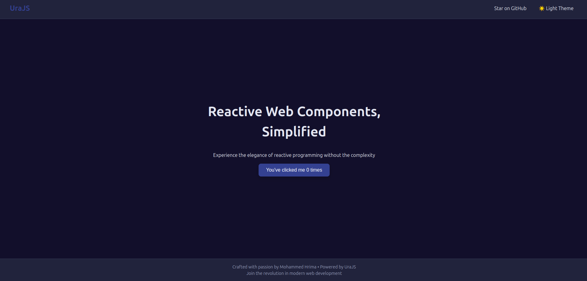

<p align="center">
  
</p>

**UraJS** is a lightweight single-page application (SPA) framework designed to make building interactive and dynamic web applications intuitive and efficient.

Inspired by the simplicity of **React**, the directory-based routing of **Next.js**, UraJS introduces its own take on SPA development. Its directory-based routing system automatically generates routes from the file structure, streamlining navigation setup for developers.

With built-in support for **live reloading**, **state-driven UI updates**.

## Summary
- [Get Started](#get-started)
- [Generate Route](#generate-route)
- [Generate Component](#generate-component)
- [Example Generated JSX](#example-generated-jsx)
- [Folders Structure](#folders-structure)
- [Configuration](#configuration)
- [Navigate between routes](#navigate-between-routes)
- [Navigate with Parameters](#navigate-with-parameters)
- [Tailwind](#tailwind)
- [Conditions `<ura-if>/<ura-elif>/<ura-else>`](#conditions)
- [Loops `<ura-loop>`](#loops)
- [Component Composition](#component-composition)
- [Deploy using Docker](#deploy-using-docker)

## Get Started
To get started with **UraJS**, follow these simple steps:
1. **Clone the repository**:
```bash
   git clone https://github.com/mohammedhrima/UraJS
```
2. **Navigate to the project directory**:
```bash
   cd UraJS
```
3. **Install the dependencies**:
```bash
   npm install
```
4. **Start the development server**:
```bash
   npm start
```
5. **Open your browser** and visit http://localhost:17000 to see the app running.

You should see something like this:
<p align="center">
  
</p>

6. **All commands**:
```bash
  npm start      # Start development server
  npm run clear  # Clear outfile
  npm run route  # Create route
  npm run comp   # Create component
  npm run build  # Build for production
  npm run config # Change configuration
```

## Generate Route
To generate routes automatically, you can use the following commands:

### Basic Route
To generate a **route with Header, Main, and Footer components**:
    
```bash
npm run route user
```

This will create:
```
pages/user/
  ├── user.jsx     # Main route file
  ├── header.jsx   # Header component
  ├── main.jsx     # Main content component
  ├── footer.jsx   # Footer component
  ├── user.css     # Route styles (if CSS enabled)
  └── components/  # Folder for route-specific components
```

The route will be accessible at `http://localhost:17000/user`

### Nested Route
To generate a **nested route**:
    
```bash
npm run route user/settings
```

This creates: `pages/user/settings/settings.jsx` mapped to `/user/settings`

## Generate Component

### Shared Components (Global)
To create a **shared component** available across all routes:

```bash
npm run comp Button
npm run comp Navbar
```

This creates components in `src/components/`:
```
src/components/
  ├── Button.jsx
  ├── Button.css
  ├── Navbar.jsx
  └── Navbar.css
```

### Route-Specific Components
To create a **component specific to a route**:

```bash
npm run comp user/UserProfile user/UserStats
```

This creates components in the route's components folder:
```
pages/user/components/
  ├── UserProfile.jsx
  ├── UserProfile.css
  ├── UserStats.jsx
  └── UserStats.css
```

### Nested Route Components
For deeply nested routes:

```bash
npm run comp user/settings/SettingsForm
```

Creates: `pages/user/settings/components/SettingsForm.jsx`

## Example Generated JSX

### Component
```jsx
import Ura, { VDOM, Props } from 'ura';

function Button(props: Props): VDOM {
  const [count, setCount] = Ura.State(0);

  return (
    <div className="button">
      <h1>Hello from Button component!</h1>
      <button onclick={() => setCount(count() + 1)}>
        Click me [{count()}]
      </button>
    </div>
  );
}

export default Button;
```

### Route
```jsx
import Ura, { VDOM, Props } from 'ura';
import Header from './header';
import Main from './main';
import Footer from './footer';

function User(props: Props): VDOM {
  document.title = "user Page";

  return (
    <div className="flex flex-col min-h-screen text-text bg-bg">
      <Header />
      <Main />
      <Footer />
    </div>
  );
}

export default User;
```

### Header Component (Generated)
```jsx
import Ura, { VDOM, Props } from 'ura';

function Header(props: Props): VDOM {
  return (
    <header className="bg-nav px-8 py-4 flex justify-between items-center border-b border-border">
      <div className="text-[--accent] text-2xl font-bold">UraJS</div>
      <nav>
        <a className="ml-6 text-text hover:text-[#3c82c9] transition-colors duration-300" 
           href="https://github.com/mohammedhrima/UraJS/" target="_blank">
          github
        </a>
      </nav>
    </header>
  );
}

export default Header;
```

### Main Component (Generated)
```jsx
import Ura, { VDOM, Props } from 'ura';

function Main(props: Props): VDOM {
  const [count, setCount] = Ura.State(0);

  return (
    <main className="flex-1 flex flex-col items-center justify-center px-4 py-12 text-center">
      <h1 className="text-4xl md:text-5xl mb-8 text-[#f1f5f9]">
        Hello from User route!
      </h1>
      <button className="px-6 py-3 bg-[--accent] text-white rounded-lg text-base shadow-lg transition-transform transform hover:bg-[#3c82c9] hover:-translate-y-0.5 active:scale-95" 
              onclick={() => setCount(count() + 1)}>
        Click me [{count()}]
      </button>
    </main>
  );
}

export default Main;
```

### Footer Component (Generated)
```jsx
import Ura, { VDOM, Props } from 'ura';

function Footer(props: Props): VDOM {
  return (
    <footer className="bg-nav text-center p-4 text-sm border-t border-border text-text-muted">
      <p>Built with 💙 using UraJS</p>
    </footer>
  );
}

export default Footer;
```

### Explanation of the Code:
1. **State Management**: 
   - `const [getter, setter] = Ura.State(initialValue);` creates reactive state
   - Components can hold multiple states
   - Essential for updating the view when state changes
   - Use `getter()` to access value, `setter(newValue)` to update

2. **Rendering the Component**:
   - Components directly return JSX (similar to React)
   - No need for render wrapper anymore

3. **Event Handling**:
   - `<button onclick={() => setter(getter() + 1)}>`: Updates state on click
   - Event names should be written in lowercase (onclick, onchange, onkeyup, etc.)
   - For a complete list of event names, check [W3Schools JavaScript Events](https://www.w3schools.com/jsref/obj_events.asp)

4. **Route Structure**:
   - Routes are automatically split into Header, Main, and Footer components
   - Easy to customize each section independently
   - Main route file imports and composes these components

## Folders Structure
```
UraJS/
├── out/                      # Production-ready transpiled JavaScript files
│   └── (All framework and app code transpiled to vanilla JS)
│
├── scripts/                  # Scripts used by the framework
│
├── src/
│   ├── assets/              # Static assets
│   │   └── (image.png, ...)
│   │
│   ├── components/          # Shared/global components
│   │   ├── Button.jsx
│   │   ├── Button.css
│   │   ├── Navbar.jsx
│   │   └── Navbar.css
│   │
│   ├── pages/               # Route-based components
│   │   ├── home/           # Example route: /home
│   │   │   ├── home.jsx    # Main route file
│   │   │   ├── header.jsx  # Route header
│   │   │   ├── main.jsx    # Route main content
│   │   │   ├── footer.jsx  # Route footer
│   │   │   ├── home.css    # Route styles
│   │   │   └── components/ # Route-specific components
│   │   │       ├── Hero.jsx
│   │   │       └── Features.jsx
│   │   │
│   │   ├── user/           # Example route: /user
│   │   │   ├── user.jsx
│   │   │   ├── header.jsx
│   │   │   ├── main.jsx
│   │   │   ├── footer.jsx
│   │   │   └── components/
│   │   │       ├── UserProfile.jsx
│   │   │       └── UserStats.jsx
│   │   │
│   │   ├── main.js         # Application entry point
│   │   ├── main.scss       # Global styles/variables
│   │   └── tailwind.css    # Tailwind imports (if enabled)
│   │
│   ├── services/           # Business logic/services
│   │   ├── api.jsx        # API service layer
│   │   └── events.js      # Event bus/service (in development)
│   │
│   └── ura/               # Framework frontend code
│
├── tailwind.config.js     # Tailwind CSS configuration
├── ura.config.js          # Framework configuration
├── tsconfig.json          # TypeScript configuration
└── package.json           # Project dependencies and scripts
```

## Configuration
The `ura.config.js` file allows you to customize various settings for your project.

Default config:
```js
typescript: "disable" 
dirRouting: "enable"
defaultRoute: "home"
tailwind: "disable"
scss: "disable"
css: "enable"
port: 17000
```

To change it, run:
```bash
npm run config
```

You will get validation messages like this:
<p align="center">
  
</p>

## Navigate between routes
```bash
npm run route home about
npm run comp Navbar
```

```jsx
// components/Navbar.jsx
import Ura from 'ura';

function Navbar() {
  const [render, State] = Ura.init();

  return (
    <nav className="navbar">
      <ul>
        <li onclick={() => Ura.navigate("/home")}><a href="/home">Home</a></li>
        <li onclick={() => Ura.navigate("/about")}><a href="/about">About</a></li>
      </ul>
    </nav>
  );
}

export default Navbar;
```

**Explanation:**
- `Ura.navigate` is a built-in function that programmatically changes the current route
- It updates the URL and loads the corresponding component

### Adding the Navbar to a Route
```jsx
// pages/home/home.jsx
import Ura from 'ura';
import Navbar from '../../components/Navbar.js';
import Header from './header';
import Main from './main';
import Footer from './footer';

function Home() {
  document.title = "Home Page";

  return (
    <div>
      <Navbar />
      <Header />
      <Main />
      <Footer />
    </div>
  );
}

export default Home;
```

## Navigate with Parameters
```bash
npm run route home
npm run route user
```

### Sending Parameters
```jsx
import Ura from 'ura';

function Home() {
  return (
    <div className="home">
      <h1>Welcome to the Home Page!</h1>
      <button onclick={() => Ura.navigate("/user", { name: "John Doe", email: "john.doe@example.com" })}>
        Show Details
      </button>
    </div>
  );
}

export default Home;
```

### Receiving Parameters
```jsx
import Ura from 'ura';

function Main() {
  const { name, email } = Ura.getParams();

  return (
    <main className="user">
      <h1>User Name: {name}</h1>
      <p>Email: {email}</p>
    </main>
  );
}

export default Main;
```

## Tailwind
Make sure to enable Tailwind in config to see the changes:

```jsx
import Ura from "ura";

function Button() {
  const [count, setCount] = Ura.State(0);

  return (
    <button className="px-4 py-2 bg-blue-500 text-white rounded-lg hover:bg-blue-700 transition-colors duration-300"
            onclick={() => setCount(count() + 1)}>
      Click Me [{count()}]
    </button>
  );
}

export default Button;
```

## Conditions
You can use conditions as tags or attributes:
- `<ura-if>`, `<ura-elif>`, `<ura-else>` as tags
- `ura-if`, `ura-elif`, `ura-else` as attributes

```jsx
import Ura from "ura";

function WeatherDisplay() {
  const [temp, setTemp] = Ura.State(25);
  const [isRaining, setIsRaining] = Ura.State(false);

  return (
    <div className="weather-widget">
      <h2>Weather Conditions</h2>
      
      {/* Tag syntax */}
      <ura-if cond={temp() > 30}>
        <div className="alert">Heat warning!</div>
      </ura-if>
      <ura-elif cond={temp() < 0}>
        <div className="alert">Freezing temperatures!</div>
      </ura-elif>
      <ura-else>
        <div>Normal temperature range</div>
      </ura-else>

      {/* Attribute syntax */}
      <div ura-if={isRaining()}>Bring an umbrella!</div>
      <div ura-else>No rain expected today</div>

      {/* Ternary operator */}
      <div>
        Current temperature: {temp()}°C - 
        {temp() > 20 ? " Warm" : " Cool"}
      </div>

      {/* Controls */}
      <div className="controls">
        <button onclick={() => setTemp(temp() + 5)}>Increase Temp</button>
        <button onclick={() => setTemp(temp() - 5)}>Decrease Temp</button>
        <button onclick={() => setIsRaining(!isRaining())}>Toggle Rain</button>
      </div>
    </div>
  );
}

export default WeatherDisplay;
```

## Loops
The `<ura-loop>` tag can be styled with className and other attributes:

```jsx
import Ura from "ura";

function ShoppingList() {
  const [items, setItems] = Ura.State(["Milk", "Eggs", "Bread", "Fruits"]);

  return (
    <div className="shopping-list">
      <h2>Grocery Items</h2>

      {/* Tag syntax - <ura-loop> won't be shown in DOM */}
      <ura-loop on={items()}>
        {(item, index) => (
          <div key={index} className="item">
            <span>{index + 1}. {item}</span>
            <button onclick={() => setItems(items().filter((_, i) => i !== index))}>
              Remove
            </button>
          </div>
        )}
      </ura-loop>
      
      {/* Attribute syntax - div will be shown even if array is empty */}
      <div ura-loop={items()}>
        {(item, index) => (
          <div key={index} className="item">
            <span>{index + 1}. {item}</span>
            <button onclick={() => setItems(items().filter((_, i) => i !== index))}>
              Remove
            </button>
          </div>
        )}
      </div>

      {/* Using map method */}
      {items().map((item, index) => (
        <div key={index} className="item">
          <span>{index + 1}. {item}</span>
          <button onclick={() => setItems(items().filter((_, i) => i !== index))}>
            Remove
          </button>
        </div>
      ))}

      <button onclick={() => setItems([...items(), "New Item"])}>
        Add Item
      </button>
    </div>
  );
}

export default ShoppingList;
```

## Component Composition

### Card Component Example
```jsx
import Ura from 'ura';

function Card(props, children) {
  return (
    <div className="card">
      <h2>{props.title}</h2>
      {children}
    </div>
  );
}

export default Card;
```

### Using the Card Component
```jsx
import Ura from 'ura';
import Card from '../../components/Card.js';

function Dashboard() {
  return (
    <div>
      <Card title="User Info">
        <p>Name: John Doe</p>
        <p>Email: john@example.com</p>
      </Card>

      <Card title="Stats">
        <ul>
          <li>Posts: 34</li>
          <li>Followers: 120</li>
        </ul>
      </Card>
    </div>
  );
}

export default Dashboard;
```

## Deploy using Docker

### 1. Build the Project
To build the project and generate the necessary Docker configuration files:

```bash
npm run build
```

This command generates a `docker` directory with the following structure:
```
docker/
├── app/                # All transpiled files
├── nginx/             # Nginx configuration
│   └── nginx.conf
├── Dockerfile         # Docker image configuration
├── docker-compose.yml # Docker Compose setup
└── Makefile          # Helper commands
```

### 2. Build and Run the Container
Navigate to the docker directory:
```bash
cd docker
```

Start the Docker container:
```bash
make
```

### 3. Stop the Container
```bash
make down
```

### 4. Clean Up Volumes and Remove Docker Images
```bash
make clean
```

### 5. Access Your Application
After starting the container, open your browser and go to:
```
http://localhost:17000
```

The port is automatically configured during the build process based on your `ura.config.js` settings.